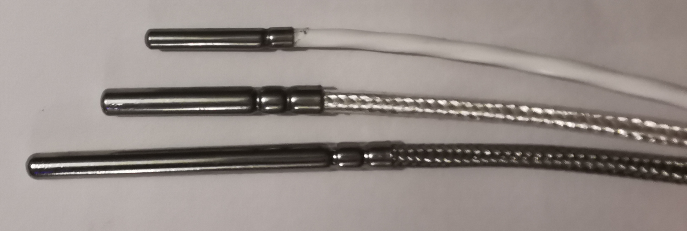
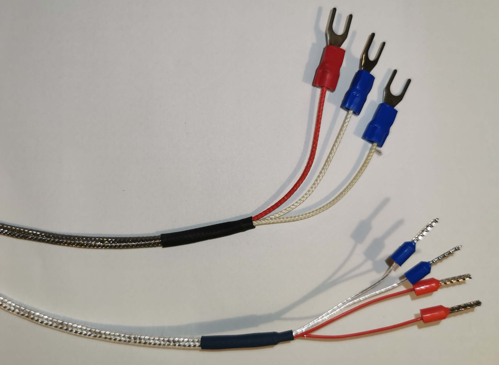
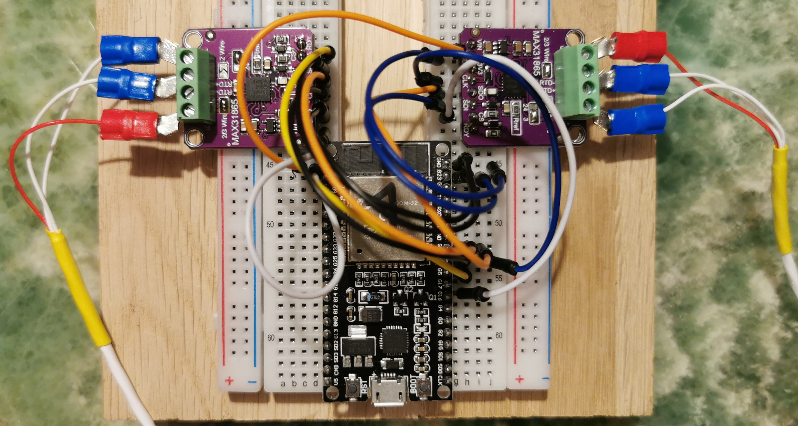
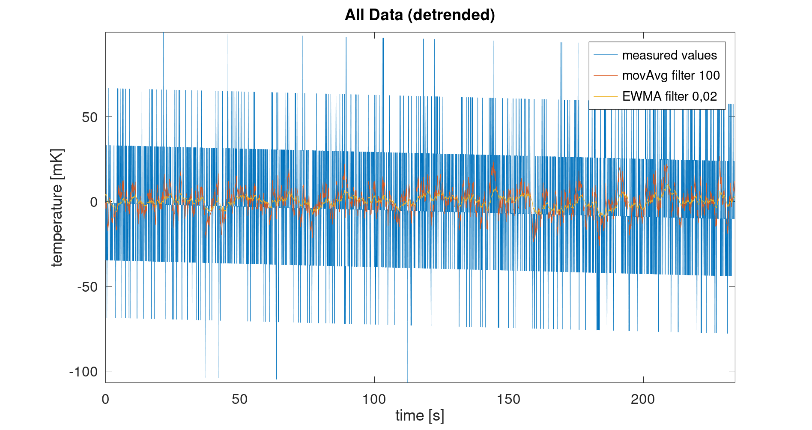
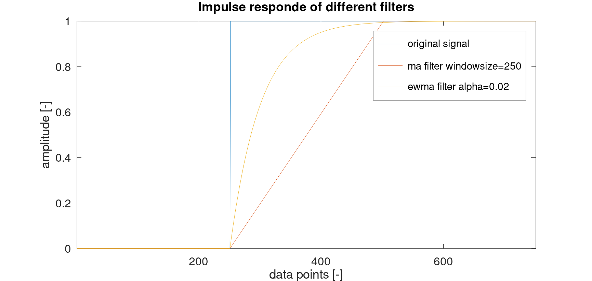
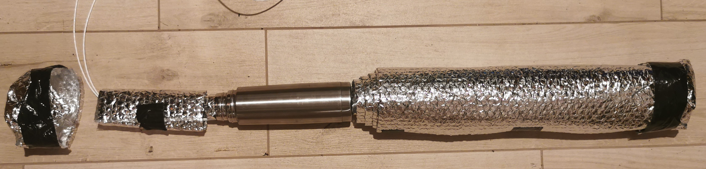
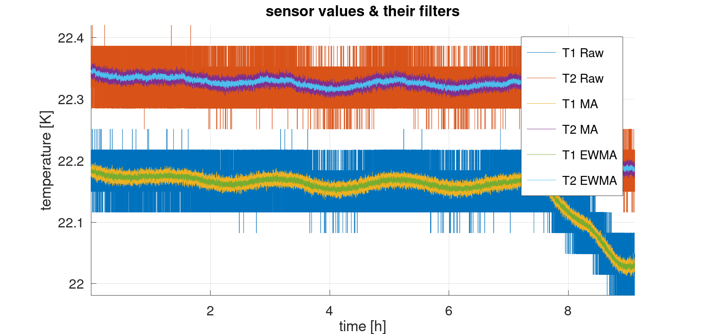
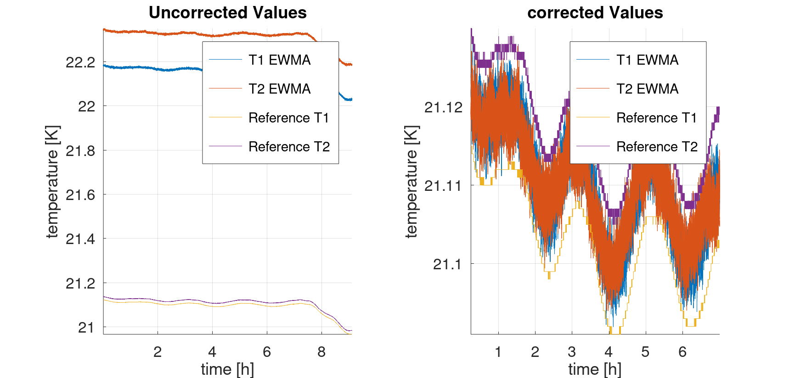

# Cheap high precision temperature measurement

## Abstract

In this Article a sub-10€ per channel setup for high resolution temperature mesurement is presented.
3 or 4-Wire PT100 RTDs are used in conjunction with a MAX31865 evaluation board.
A Simple methodology is then presented to Calibrate the temperature sensors against themselves or a calibrated reference.
Less than 10 mK deviation from the reference are achieved.

## Motivation

High accuracy temperature Sensors have many uses.
In this instance the specific usecase is a diamond turning lathe (DTL).
The goal is to place over a dozen sensors around the machine to be able to monitor temperatures of the components and frame coolant.
One or more sensors will also be used to regulate the coolant temperature entering the machine.
With so many sensors it enables the user to judge when the machine has reached its temperature equilibrium upon being turned on.

## Electronics & Code

3 or 4-Wire PT100 RTDs are used in conjunction with a MAX31865 evaluation board
They are available in several different sizes and lengths of the probe tip.

A 3-Wire PT100 + MAX31865 set can be bought on Aliexpress for under 10€ per set.
4-Wire Pt100 sensors are slightly more [expensive](https://www.aliexpress.com/item/32868816875.html?spm=a2g0o.order_detail.order_detail_item.4.ef3ef19cfP4PNi).
For use with a 3-Wire PT100 sensor some of the solder pads on the MAX31865 have to be connected via soldering.
The 3 and 4-Wire sensors allow the evaluation board to compensate for Resistance in the wires leading up to the sensor.
Since that resistance is also slightly temperature dependent this eliminates the influence of the wire temperature.
The measurement values can be accessed via an SPI interface by any device. Here an ESP32 is used.

a reading takes about 80 milliseconds, so up to about 12.5 Hz measurment rate are possible (yes this is rather slow but sufficient in most applications).
The resolution at room temperature is about 34 mK. It was found that the measurement noise has a pretty much perfect standard distribution.
Thus by averaging multiple values higher resolution than 34 mK can by achieved by sacrificing response speed and bandwidth.
Both a Moving average filter and a Exponential weight moving average filter were considered.

The following image shows the impulse response of both filters.

Visual Studio Code is used with Platform-IO to flash the ESP32.  
After finishing up the ESP32 setup, logging the data is the next step.
RealTerm adds a matlab timestamp and logging the data to the harddrive of the computer.
Evaluation is done using Octave (open source alternative to matlab).

## Calibration Method

The goal while calibrating the sensors is to create an extremely homogenous enviroment for all the temperature sensors to experience the same temperature.  
This can be achieved by using a thermos flask in a temperature stable room.
A basement room is fine to use. In this instance a temperature controlled measuring room was used.  
The sensors are placed in the flask, no water or other liquid is added.
Liquids tend to develop non-homogenous temperature layering.  
Then the flask is sealed. For sealing a piece of cork or foam can be used to create a good insulation.
Optionally it can be further insulated with bubblerap or any other insulating material.  

Ideally calibration is performed with a traced refence to physical constants to get the absolute temperature right.
But even without such a reference sensor getting multiple sensors to read the same temperature can be very useful (for example: monitoring multiple points across a machine to see if the temperatures are equalized across it).  
After calibration the pairings of the PT100 probes and MAX31865 boards should be kept the same and the offset should be saved.
By averaging over a timeframe of several hours random errors can be averaged and repeatable results were achieved.  
Two known refences are used to calibrate the absolute temperature in this case.
There references are a material sensor and a air sensor of a SIOS interferometer.
Those are calibrated to +/- 50 mK absolute accuracy as per certificate.

## Results

The following image shows the temperature log all throughout a night in the measuring room.
After 7 AM the effects of the sun shining through the windows and people working in the room can be destinctly seen.

By averaging both the reference sensors and the each of the DIY probes over the time from about 12:15 AM to 7 AM the offset can be calculated.

The total temperature swing across that timeframe is less than 40 mK. In a Basement room with all windows and doors shut similar results were achieved after about 10 hours of acclimatization.  
There is a slight phase shift between the sensors. That is likely due to the different thermal masses and thermal conductivities of the sensors.

## Outlook

The long-therm stability of calibration will be the topic of a future investigation once the sensors ran for a few months.  
The influence of shocks on the PT100 are also a topic of interest, since this might throw the calibration off as well.  
The effects of aging are also worthy of a investigation. Apparently if a RTD is subject to a temperature is has never been subjected to before it changes its characteristics (no concrete sources on this were found yet). This might be solvable with a few cyles of freezing it and then heating the sensor in the oven.
